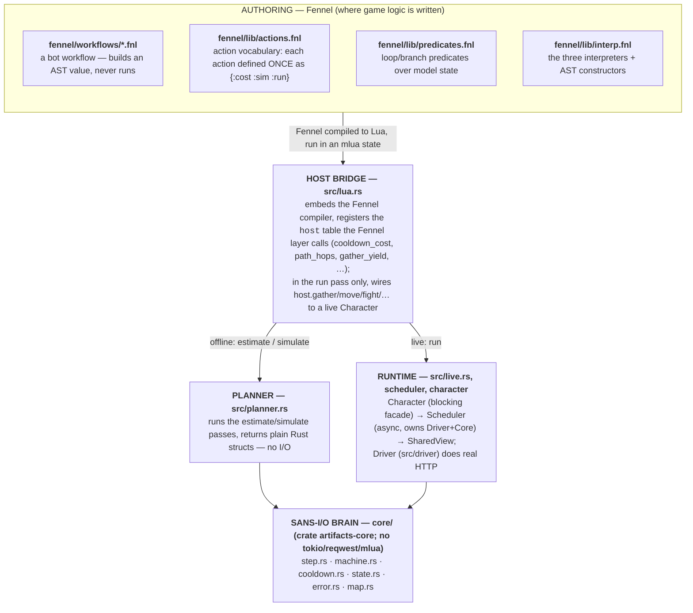

# Architecture

This document explains how the pieces of the Artifacts MMO client fit together: where user-authored game logic lives, and how it maps down through the Rust code to either an offline prediction or a real API call. Read this before making a targeted edit — it tells you which layer owns a given concern.

## The one-paragraph version

Bot behaviour is authored in **Fennel** as a _workflow_ — a tree of data (an AST), not opaque code. Because a workflow is data, the same source can be walked by **three interpreters**: `estimate` (predict time/actions/cost, no I/O), `simulate` (resolve loop counts against a mock model), and `run` (real execution). The Rust side is split so that purity is provable at compile time: a sans-I/O **`core`** crate holds all game semantics (cooldowns, rate-limit buckets, the request/response state machine, pathfinding) with no sockets or clocks, and an **`artifacts`** crate adds the I/O runtime, the Fennel host, and the CLI on top.

## Layer map

## Where game logic lives: the Fennel layer

All _user-intended_ game logic is authored in `fennel/`. Nothing here executes on load — a workflow file evaluates to a **data tree** that one of the interpreters later walks.

### `fennel/workflows/*.fnl` — what the bot should do

A workflow is built from AST constructors (`seq`, `action`, `repeat_until`, `repeat_n`, `when_pred`). Example (`farm-copper.fnl`): travel to the copper tile, gather until inventory is full, travel to the bank, deposit everything. Loading the file yields the tree; it performs no I/O and makes no decisions by itself.

### `fennel/lib/actions.fnl` — the action vocabulary

**The single most important invariant in the codebase.** Each action (`gather`, `travel-to`, `deposit-item`, `craft`, `rest`, `fight`, …) is defined **exactly once** as a record with three fields:

| Field   | Used by  | Meaning                                                 |
| ------- | -------- | ------------------------------------------------------- |
| `:cost` | estimate | Pure prediction of the cooldown this action will incur. |
| `:sim`  | simulate | Pure advance of the model state (e.g. add item to inv). |
| `:run`  | run      | Real execution, via a `host.*` function.                |

`def-action` asserts all three fields exist at load time. Because all three interpreters read the same table, the estimate, the simulation, and the real run **cannot describe different actions** — if `:sim` and `:run` diverged, plans would silently lie. Add a new action here, with all three facets, rather than special-casing it in an interpreter.

### `fennel/lib/predicates.fnl` — loop and branch conditions

Predicates (`inventory-full?`, `hp-below?`, `at?`) read a _model state_ table. The key subtlety: the same predicate must work against both the pure model table (in estimate/simulate) and the live character snapshot (in run). That is guaranteed by funnelling both through one builder — see "The state surface" below.

### `fennel/lib/interp.fnl` — the three interpreters

Walks the workflow AST. The node types are `:seq`, `:action`, `:repeat-until`, `:repeat-n`, `:when`.

- **estimate** — accumulates `:seconds`, `:actions`, and `:bucket-cost` by calling each action's `:cost` and threading state through its `:sim`. `repeat-until` loops are run against the model until the predicate flips, and the resolved iteration count is recorded under its `:label` (e.g. `gathers: 10`).
- **simulate** — currently a deterministic wrapper over estimate (stochastic combat is stubbed) that also reports `:feasible` and surfaces the resolved loop counts.
- **run** — executes each action's `:run` against the real character, re-reading the live view (`host.view`) to evaluate `repeat-until` / `when` predicates between steps.

## How Fennel maps back to Rust

### The host bridge — `src/lua.rs`

`setup_lua` builds an mlua state: it loads the vendored Fennel compiler, evaluates the three lib files, and installs a `host` table of Rust functions the Fennel layer calls. Two distinct sets of host functions:

- **Always present (pure):** `cooldown_cost`, `path_hops`, `gather_yield`, `resource_level`. These back the `:cost`/`:sim` facets, so estimate and simulate need no character and no network.
- **Run-only (live):** `gather`, `move`, `fight`, `rest`, `deposit_item`, `deposit_all`, `view`. Registered only when a `Character` is supplied; otherwise replaced by a stub that errors loudly, so an accidental live call during planning fails fast instead of silently doing nothing.

`path_hops` uses the core A* pathfinder when a `GameMap` was loaded, and falls back to Manhattan distance otherwise — so an estimate is still meaningful with no map.

### The state surface (why predicates don't drift)

`predicate_state` in `src/lua.rs` is the **single definition** of the hyphen-cased key surface predicates read (`st.x`, `st.hp`, `st.inventory-count`, …). Both the planner's seed state (`planner::build_state`) and the live `host.view` are built through this one helper, so a predicate sees the same shape whether it runs against the mock model or the real character. (Note the deliberate hyphen-case here: switching these keys to underscores would break `predicates.fnl`.)

### Offline path — `src/planner.rs`

`estimate` / `simulate` set up a Lua state with **no** character, build a seed model state (`PlanSeed` — position, hp, inventory, the gather tile's level/resource), call the corresponding Fennel pass, and marshal the Lua result back into plain Rust structs (`EstimateResult`, `SimulateResult`). This keeps `mlua` types out of callers like the CLI. `PlanSeed::from_view` lets a plan be seeded from a live character.

### Live path — `src/live.rs` + the runtime modules

`live::run_workflow` wires the runtime together and runs a workflow's `run` pass against a real driver. The threading model matters:

- **`Character` (`src/character.rs`)** — the blocking facade the host fns hold. Each method (`move_to`, `gather`, …) sends an `Intent` to the scheduler over a channel and **blocks the script thread** waiting for the `Outcome`. This is what lets the Fennel `run` pass read as straight-line synchronous code.
- **`Scheduler` (`src/scheduler.rs`)** — runs on its own `std::thread`, owns the `Driver` and the `core::Core`. It loops: feed the intent to `Core`, ask `Core::next_step(now)` what to do, execute that `Step` on the driver, feed the response back via `Core::handle_response`. Transient codes (499/486/429) drive a `Retry`; a benign 490 is a no-op; success returns the `Outcome`.
- **`SharedView` (`src/view.rs`)** — an `Arc<RwLock<CharacterView>>` refreshed after every outcome. `host.view` reads it synchronously so predicates never block.
- **`Driver` (`src/driver/`)** — the I/O boundary trait. It owns the **authoritative clock**, so the scheduler reads `driver.current_time()` rather than `Instant::now()`. `mock` supplies a fake clock + canned responses for hermetic tests; `http` is reqwest + tokio against the live API.

### The sans-I/O brain — `core/`

`core` is a separate crate **on purpose**: its dependency tree is serde/thiserror only — no tokio, reqwest, or mlua — so the compiler _proves_ it does no I/O. It holds the parts of the game that are pure functions of (state, response, clock):

| Module | Responsibility |
| --- | --- |
| `step.rs` | The vocabulary: `Intent` (what to do), `Step` (what the driver does next), `Outcome`/`OutcomeKind`, `CharacterView`. |
| `machine.rs` | `Core` — `next_step(now)` decides sleep/request/done; `handle_response(status, body, now)` updates cooldown + buckets and classifies the result. **Pure: the caller supplies `now`.** |
| `cooldown.rs` | Per-action cooldown formulas (also exposed to Fennel via `host.cooldown_cost`). |
| `state.rs` | `CharacterState` (`busy_until`) and `RateLimitState` token buckets. |
| `error.rs` | Maps HTTP/response codes to retry/no-op/fatal classifications. |
| `map.rs` | Overworld A* pathfinding and the shared Manhattan distance. |

The only place `src/` reaches into `core` directly is the scheduler driving `Core`, plus `host.cooldown_cost`/`path_hops` re-exposing the pure formulas to Fennel.

## The CLI — `src/main.rs`

A thin dispatcher over the two paths above:

| Command | Path | Needs token | What it does |
| --- | --- | --- | --- |
| `artifacts estimate <wf.fnl>` | offline | no | `planner::estimate` → prints actions/seconds. |
| `artifacts simulate <wf.fnl> [n]` | offline | no | `planner::simulate` → prints feasibility/loops. |
| `artifacts run <wf.fnl> <character>` | live | yes | Fetches character + map, then `live::run_workflow`. |

## Adding things — where does it go?

- **A new bot behaviour** → a new file in `fennel/workflows/`, built from existing AST constructors. No Rust changes if it only uses existing actions.
- **A new action** (e.g. `withdraw-item`) → `fennel/lib/actions.fnl` with all three of `:cost`/`:sim`/`:run`, plus the backing `host.*` fn in `src/lua.rs` and a `Character` method if it needs the live runtime.
- **A new predicate** → `fennel/lib/predicates.fnl`; if it needs a new state field, add it to `predicate_state` in `src/lua.rs` so both passes see it.
- **A new game rule** (cooldown formula, response code, pathfinding) → `core/`. Keep it pure; if you reach for a clock or a socket here, it belongs in `src/`.

## See also

- [`README.md`](../README.md) — quick start, build/test commands, and the authoritative external API references.
</content>

</invoke>
