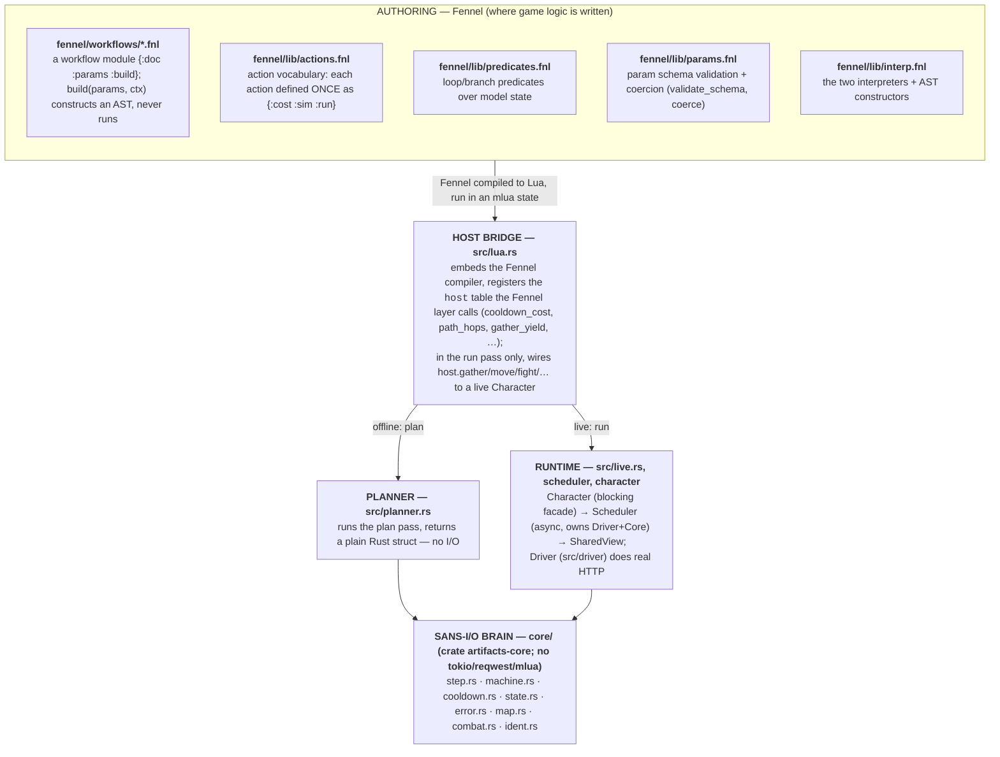

# Architecture

This document explains how the pieces of the Artifacts MMO client fit together: where user-authored game logic lives, and how it maps down through the Rust code to either an offline prediction or a real API call. Read this before making a targeted edit — it tells you which layer owns a given concern.

## The one-paragraph version

Bot behaviour is authored in **Fennel** as a _workflow_ — a tree of data (an AST), not opaque code. Because a workflow is data, the same source can be walked by **two interpreters**: `plan` (predict time/actions/cost _and_ feasibility by walking the control flow against a seed model state — no I/O; seed it from a live character for a per-character prediction) and `run` (real execution). The Rust side is split so that purity is provable at compile time: a sans-I/O **`core`** crate holds all game semantics (cooldowns, rate-limit buckets, the request/response state machine, pathfinding) with no sockets or clocks, and an **`artifacts`** crate adds the I/O runtime, the Fennel host, and the CLI on top.

## Layer map

```mermaid
flowchart TD
    subgraph authoring["AUTHORING — Fennel (where game logic is written)"]
        direction TB
        wf["<b>fennel/workflows/*.fnl</b><br/>a workflow module {:doc :params :build}; build(params, ctx) constructs an AST, never runs"]
        act["<b>fennel/lib/actions.fnl</b><br/>action vocabulary: each action defined ONCE as {:cost :sim :run}"]
        pred["<b>fennel/lib/predicates.fnl</b><br/>loop/branch predicates over model state"]
        params["<b>fennel/lib/params.fnl</b><br/>param schema validation + coercion (validate_schema, coerce)"]
        interp["<b>fennel/lib/interp.fnl</b><br/>the two interpreters + AST constructors"]
    end

    bridge["<b>HOST BRIDGE — src/lua.rs</b><br/>embeds the Fennel compiler, registers the <code>host</code> table the Fennel layer calls (cooldown_cost, path_hops, gather_yield, …);<br/>in the run pass only, wires host.gather/move/fight/… to a live Character"]

    planner["<b>PLANNER — src/planner.rs</b><br/>runs the plan pass, returns a plain Rust struct — no I/O"]
    runtime["<b>RUNTIME — src/live.rs, scheduler, character</b><br/>Character (blocking facade) → Scheduler (async, owns Driver+Core) → SharedView;<br/>Driver (src/driver) does real HTTP"]

    core["<b>SANS-I/O BRAIN — core/ (crate artifacts-core; no tokio/reqwest/mlua)</b><br/>step.rs · machine.rs · cooldown.rs · state.rs · error.rs · map.rs · combat.rs · ident.rs"]

    authoring -->|"Fennel compiled to Lua, run in an mlua state"| bridge
    bridge -->|"offline: plan"| planner
    bridge -->|"live: run"| runtime
    planner --> core
    runtime --> core
```

## Where game logic lives: the Fennel layer

All _user-intended_ game logic is authored in `fennel/`. Nothing here executes on load — a workflow file evaluates to a **data tree** that one of the interpreters later walks.

### `fennel/workflows/*.fnl` — what the bot should do

A workflow file evaluates to a **workflow module** — a table `{:doc <string?> :params <schema?> :build (fn [params ctx] ast-or-nil)}` — not a bare AST. `build` is a pure constructor of the workflow AST from its declared `:params` (coerced CLI/TUI inputs) and `ctx` (a read-only seed-state snapshot); it runs at load time (plan or run) and returns the tree built from the AST constructors (`seq`, `action`, `repeat_until`, `repeat_n`, `when_pred`). Example (`farm.fnl`): given `target=copper_rocks`, travel to that resource's tile, gather until inventory is full, travel to the bank, deposit everything. `build` returning **nil** signals "nothing to do" (the done-sentinel M7's `--until-done` loop stops on); a single-shot `plan`/`run` treats a nil build as a loud mistake. A bare-AST file (the old format) is rejected with a prescriptive error telling the author to wrap it in `{:build (fn [_ _] <ast>)}`.

The module protocol is implemented once, in `src/workflow.rs` (`load`/`schema`); parameter shape validation and coercion live once in `fennel/lib/params.fnl` (`validate_schema`, `coerce`). Semantic validity of a game code (is `copper_rocks` a real resource?) is **not** re-checked there — it stays a loud host lookup (`host.find_tile`, `host.monster_stats`, …) firing during `build`/`plan`.

### `fennel/lib/actions.fnl` — the action vocabulary

**The single most important invariant in the codebase.** Each action (`gather`, `travel-to`, `deposit-item`, `craft`, `rest`, `fight`, …) is defined **exactly once** as a record with three fields:

| Field   | Used by | Meaning                                                 |
| ------- | ------- | ------------------------------------------------------- |
| `:cost` | plan    | Pure prediction of the cooldown this action will incur. |
| `:sim`  | plan    | Pure advance of the model state (e.g. add item to inv). |
| `:run`  | run     | Real execution, via a `host.*` function.                |

`def-action` asserts all three fields exist at load time. The `plan` pass uses `:cost` and `:sim` together (it sums `:cost` while threading state through `:sim`); `run` uses `:run`. Because both interpreters read the same table, the prediction and the real run **cannot describe different actions** — if `:sim` and `:run` diverged, plans would silently lie. Add a new action here, with all three facets, rather than special-casing it in an interpreter.

### `fennel/lib/predicates.fnl` — loop and branch conditions

Predicates (`is_full`, `hp_below`, `is_at`, `is_winnable`) read a _model state_ table. The key subtlety: the same predicate must work against both the pure model table (in plan) and the live character snapshot (in run). That is guaranteed by funnelling both through one builder — see "The state surface" below. They are defined once here and reused across workflows; the exported keys are deliberately underscore-cased (no `-`/`?`), because Fennel mangles a hyphen or `?` in a bare cross-file reference to a different symbol than the installed global, so a workflow referencing `inventory-full?` would silently fail to resolve.

### `fennel/lib/interp.fnl` — the two interpreters

Walks the workflow AST. The node types are `:seq`, `:action`, `:repeat-until`, `:repeat-n`, `:when`, `:group`.

- **plan** — one offline walk that predicts both cost and feasibility from a seed model state. It accumulates `:seconds`, `:actions`, and `:bucket-cost` by calling each action's `:cost` and threading state through its `:sim`, while watching the evolving state for blockers (e.g. inventory carried past capacity, a `repeat-until` that can't terminate, or a gather/craft whose skill requirement the character doesn't meet) — any blocker flips `:feasible` to false and is recorded in `:blockers`. `gather`'s `:sim` adds the resource's **real drops** (e.g. mining `copper_rocks` yields `copper_ore`, not the resource code) so a gather-then-deposit/craft plan predicts the right item codes and a `has_item` loop can terminate; because a primary drop is rate 1 its yield is deterministic, so gather stays a *hard* overflow blocker (unlike `:fight`). Both `gather` and `craft` also carry a **skill gate**: a resource/recipe above the character's `st.skills[skill]` is a hard blocker (same `--pending-blocker` mechanism as an unwinnable fight). `repeat-until` loops are run against the model until the predicate flips, and the resolved iteration count is recorded under its `:label` (e.g. `gathers: 10`). Seeding from a live character (`PlanSeed::from_view`) makes all of this specific to where that character is right now. (An earlier split — `estimate` for cost, `simulate` as a deterministic wrapper that always said "feasible" — only duplicated this walk; it was collapsed into `plan`.) Combat is modelled: `:fight`'s `:cost`/`:sim` call a deterministic, crits-off simulator (`core::combat`) to predict turns, HP loss, and expected drops; a predicted loss is a hard blocker and probabilistic drop overflow is a soft `:warnings` entry.
- **run** — executes each action's `:run` against the real character, re-reading the live view (`host.view`) to evaluate `repeat-until` / `when` predicates between steps.

### Composition — workflows requiring workflows

A workflow file is require-able under its own bare-stem name: `(require :workflows.farm)` resolves to `fennel/workflows/farm.fnl` via a `package.searchers` entry `setup_lua` installs (`src/lua.rs`), reading from `LuaSetupOptions::workflows_root` (default `fennel/workflows`, cwd-relative — the same path the TUI's workflow list scans). The loader evaluates the file through the same `eval_fennel` mechanics every other Fennel source goes through, so a required workflow module composes/nests exactly like any other Fennel `require` — `package.loaded` memoizes it, and a require cycle surfaces as Lua's standard cycle error.

`use_workflow` (`fennel/lib/interp.fnl`) is the one-call sugar for splicing a sub-workflow into a composing one: `(use_workflow :farm {:target :copper_rocks} ctx)` requires `workflows.farm`, validates+coerces the given params against *its own* declared `:params` schema (`fennel.lib.params`, the identical path a CLI/TUI invocation of `farm.fnl` alone would take), calls its `build(coerced, ctx)`, and wraps the resulting AST in a `:group` node labelled with the workflow's name and its coerced params (e.g. `"farm target=copper_rocks"`). A nil build result is a loud error here (unlike the top-level `workflow::load` path) — composition is not the M7 campaign loop, so a sub-workflow that builds to nothing must be guarded by the caller.

`:group` (`{:type :group :label <string> :steps [...]}`) is purely structural: `plan`/`run` just walk its children (no cost/action-count/blocker of its own), and `skeleton` emits one labelled row — rendered in the TUI like a loop header but with no `k/N` count (`src/tui/skeleton.rs`, `src/tui/widgets/run.rs`) — with its children indented one level deeper and the enclosing `guard-id` passed through unchanged. This is what keeps a composed or generated skeleton legible instead of one long flattened step list. `fennel/workflows/daily.fnl` (farm a resource, then hunt a monster) is the living-documentation reference for this pattern.

## How Fennel maps back to Rust

### The host bridge — `src/lua.rs`

`setup_lua` builds an mlua state: it loads the vendored Fennel compiler, evaluates the three lib files, and installs a `host` table of Rust functions the Fennel layer calls. Two distinct sets of host functions:

- **Always present (pure computation):** `cooldown_cost`, `path_hops`, `gather_yield`, `resource_level`, plus the combat trio `monster_stats`, `simulate_fight`, `find_tile`, and `recipe` (the `craft` :sim's input-consume + output-add). These back the `:cost`/`:sim` facets, so the plan pass needs no _character_. The computations are pure; the reference data some of them read (monster stats, map content incl. per-resource skill+drops, craft recipes) is fetched and cached up front by the CLI bootstrap (both the no-arg and character `plan` invocations fetch the overworld map + monster data + `/items` recipes), but the simulation itself does no I/O. The NPC merchant catalog (`/npcs/items` → `data::NpcItemData`, keyed by item code) is cached the same way — its prices are **static**, changing only on a game patch, which is exactly why it's cacheable where the Grand Exchange isn't (M3 loads it as data-only groundwork; the host-side item-sources index that consumes it lands in M5). `find_tile` takes an optional explicit anchor (`host.find_tile(kind, code, {:x :y}?)`) that overrides both the live-position (run) and seed-origin (plan) defaults — a generator threading an itinerary passes the previous destination so "nearest bank" resolves from where the character *will* be. Deliberately **not** cached: Grand Exchange order books (a live player marketplace — a TTL cache would be silently wrong; GE :sims take an author-supplied price hint instead) and task definitions (their reward/assignment nondeterminism isn't fixable with reference data — a display concern for TUI v2).
- **Run-only (live):** `gather`, `move`, `fight`, `rest`, `deposit_item`, `withdraw_item`, `deposit_all`, `view`. Registered only when a `Character` is supplied; otherwise replaced by a stub that errors loudly, so an accidental live call during planning fails fast instead of silently doing nothing. (`fight` also bails the workflow on a loss, since a loss respawns the character at 1 HP.)

`path_hops` uses the core A* pathfinder when a `GameMap` was loaded, and falls back to Manhattan distance otherwise — so a plan is still meaningful with no map.

### The state surface (why predicates don't drift)

`predicate_state` in `src/lua.rs` is the **single definition** of the hyphen-cased key surface predicates read (`st.x`, `st.hp`, `st.inventory-count`, …). Both the planner's seed state (`planner::build_state`) and the live `host.view` are built through this one helper, so a predicate sees the same shape whether it runs against the model or the real character. (Note the deliberate hyphen-case here: switching these keys to underscores would break `predicates.fnl`.)

The surface also carries `st.skills` (the eight lowercase skill levels — `st.skills.mining`, …, keyed by the same codes `ResourceSchema.skill`/`RecipeCraft.skill` use, so a gather/craft gate can index `st.skills[resource.skill]` directly) and `st.inventory` (`{code → qty}`, the character's real holdings). Both are built here from `SkillLevels`/`inventory_pairs` on the live side and from the corresponding `PlanSeed` fields on the plan side — closing two model-surface gaps M3 fixed: skills weren't on the surface at all, and `st.inventory` used to be seeded only for the plan (it was absent from `host.view`, so an inventory-contents predicate like `has_item` worked in `plan` and crashed in `run`). `state-eq`'s repeat-until stall bail compares `st.skills` by identity (like `st.combat` — no `:sim` mutates it) and `st.inventory` by contents (it's rebuilt each step).

### Offline path — `src/planner.rs`

`plan` sets up a Lua state with **no** character, builds a seed model state (`PlanSeed` — position, hp, inventory, the gather tile's level/resource), calls the Fennel `plan` pass, and marshals the Lua result back into a plain Rust struct (`PlanResult` — cost, `feasible`, and any `blockers`). This keeps `mlua` types out of callers like the CLI. `PlanSeed::default()` gives a generic best case; `PlanSeed::from_view` seeds the plan from a live character so the prediction reflects that character's current position, hp, and inventory.

### Live path — `src/live.rs` + the runtime modules

`live::run_workflow` wires the runtime together and runs a workflow's `run` pass against a real driver. The threading model matters:

- **`Character` (`src/character.rs`)** — the blocking facade the host fns hold. Each method (`move_to`, `gather`, …) sends an `Intent` to the scheduler over a channel and **blocks the script thread** waiting for the `Outcome`. This is what lets the Fennel `run` pass read as straight-line synchronous code.
- **`Scheduler` (`src/scheduler.rs`)** — runs on its own `std::thread`, owns the `Driver` and the `core::Core`. It loops: feed the intent to `Core`, ask `Core::next_step(now)` what to do, execute that `Step` on the driver, feed the response back via `Core::handle_response`. Transient codes (499/486/429) drive a `Retry`; a benign 490 is a no-op; success returns the `Outcome`.
- **`SharedView` (`src/view.rs`)** — an `Arc<RwLock<CharacterView>>` refreshed after every outcome. `host.view` reads it synchronously so predicates never block.
- **`Driver` (`src/driver/`)** — the I/O boundary trait. It owns the **authoritative clock**, so the scheduler reads `driver.current_time()` rather than `Instant::now()`. `mock` supplies a fake clock + canned responses for hermetic tests; `http` is reqwest + tokio against the live API.

### The sans-I/O brain — `core/`

`core` is a separate crate **on purpose**: its dependency tree is serde/thiserror only — no tokio, reqwest, or mlua — so the compiler _proves_ it does no I/O. It holds the parts of the game that are pure functions of (state, response, clock):

| Module | Responsibility |
| --- | --- |
| `step.rs` | The vocabulary: `Step` (what the driver does next), `Outcome`/`OutcomeKind`, `CharacterView` (re-exports `Intent`). |
| `wire.rs` | One-place intent definitions: each intent's request format + outcome parsing on one struct; the `Intent` enum and its single `&dyn IntentWire` dispatcher live beside them. |
| `machine.rs` | `Core` — `next_step(now)` decides sleep/request/done; `handle_response(status, body, now)` updates cooldown + buckets and classifies the result. **Pure: the caller supplies `now`.** |
| `cooldown.rs` | Per-action cooldown formulas (also exposed to Fennel via `host.cooldown_cost`). |
| `state.rs` | `CharacterState` (`busy_until`) and `RateLimitState` token buckets. |
| `error.rs` | Maps HTTP/response codes to retry/no-op/fatal classifications. |
| `map.rs` | Overworld A* pathfinding, the shared Manhattan distance, and nearest-content lookup (e.g. the nearest chicken/bank tile). |
| `combat.rs` | The deterministic (crits-off) fight simulator and the `MonsterView` reference-data model. Pure: `simulate(player, monster) -> FightPrediction`. |
| `ident.rs` | Opaque game-identity newtypes (`Code`, `ContentType`, `CharacterName`, `Layer`) so identities that should only ever be compared/looked up can't be confused with each other or string-manipulated. Defined via the `identity!` macro — add new identities there rather than as bare `String`s. |

The only place `src/` reaches into `core` directly is the scheduler driving `Core`, plus `host.cooldown_cost`/`path_hops` re-exposing the pure formulas to Fennel.

## The CLI — `src/main.rs`

A thin dispatcher over the two paths above:

Both `plan` and `run` take trailing `key=value` arguments that set the workflow's declared params (a token with no `=` is a loud usage error). A param/coercion error prints the workflow's declared params — that listing _is_ the per-workflow help.

| Command | Path | Needs token | What it does |
| --- | --- | --- | --- |
| `artifacts plan <wf.fnl> <character> [k=v …]` | offline + 2 fetches | yes | Fetches the character + map, seeds the plan from its live state, coerces the params, then `planner::plan` → prints feasibility/cost/loops. |
| `artifacts run <wf.fnl> <character> [k=v …]` | live | yes | Fetches character + map, coerces the params, then `live::run_workflow`. |

Example: `artifacts plan fennel/workflows/farm.fnl nillinbot target=copper_rocks`.

## Adding things — where does it go?

- **A new bot behaviour** → a new file in `fennel/workflows/` that evaluates to a workflow module `{:doc :params :build}` (see the workflows section): declare any inputs in `:params` (each `{:type … :required? :default? :doc? :options?}`), then `:build (fn [params ctx] <ast>)` constructs the AST from existing constructors. No Rust changes if it only uses existing actions and param types.
- **A composed behaviour** (a workflow built from other workflows) → same as above, but `:build` calls `use_workflow` (`fennel/lib/interp.fnl`) once per sub-workflow instead of hand-assembling actions — see `fennel/workflows/daily.fnl` for the reference shape. No Rust changes; the `workflows.<name>` require and the `:group` skeleton row are already wired for any composition.
- **A new action** → a wire struct + `Intent` enum variant + `wire()` arm in `core/src/wire.rs`; an `OutcomeKind` variant in `core/src/step.rs` only if the outcome shape is new (several intents can share one, e.g. `Deposit`/`Withdraw`); a thin `Character` wrapper method (`src/character.rs`); and a `def-action` with all three of `:cost`/`:sim`/`:run` in `fennel/lib/actions.fnl`. The run host-fn binding is a match arm in `register_intent` (`src/lua.rs`) — the compiler *requires* it: `Intent` derives `strum::EnumIter` so registration runs for every variant, and `register_intent`'s exhaustive match won't compile until the new variant is bound (no silent nil-call possible). `withdraw-item` (plans/INTENTS.md §6) is the reference example for this checklist.
- **A new predicate** → `fennel/lib/predicates.fnl`; if it needs a new state field, add it to `predicate_state` in `src/lua.rs` so both the plan and run passes see it.
- **A new game rule** (cooldown formula, response code, pathfinding) → `core/`. Keep it pure; if you reach for a clock or a socket here, it belongs in `src/`.

## See also

- [`README.md`](../README.md) — quick start, build/test commands, and the authoritative external API references.
</content>

</invoke>
